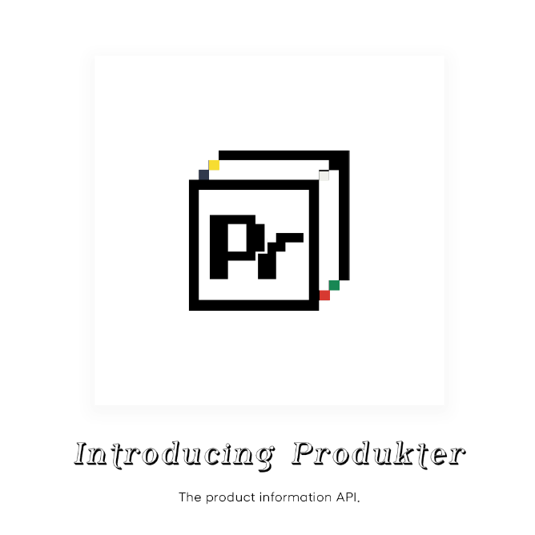
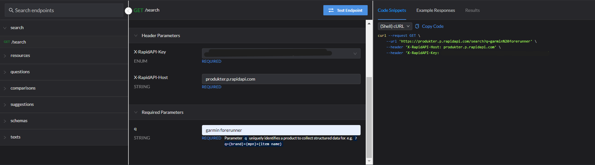

# THE PRODUKTER API



## [Produkter hosted via RapidAPI](https://rapidapi.com/vanaltrades/api/produkter) is currently depreciated due to cost.

To test out the Produkter API, please build locally or reach out with serverless deployment questions via Github.



## What can Produkter accomplish for you?

Enterprise businesses, sellers, developers, and ecommerce entrepreneurs require high quality product information to list and rank products online.

High quality content [1] improves rank on search engines and [2] provides a quality product experience that satiates buyers' expectations which leads to conversions.

Produkter allows developers to input a product identifying query and return JSON from multiple endpoints with valuable structured product information related to the input product.

The structured product information (and the api's goal) is designed to allow users to supercharge their merchandising operations.

Use this API to...

* supercharge your large language model for product content.
* collect multimedia assets for your store like image files and pdfs.
* fill in important product schema in your feed like mpns, gtins and brands.
* schedule price comparisons against top product results.
* collect user-generated product reviews to include on your pages.
* extract important product attributes for your target product and load them into your systems.
* understand what titles, descriptions and text top competitors are using to outperform the market.
* identify high demand search queries and questions about your product to highlight search engine optimization content opportunities.

## How does Produkter work?

Produkter requires a product query to be defined at each of its endpoints (?q={}).

Developers can return product information by requesting one of the following endpoints:
* /search?q=
* /resources?q=
* /schemas?q=
* /texts?q=
* /questions?q=
* /comparisons?q=
* /suggestions?q=

e.g. 
`/search?q={product brand}%20{product mpn}`


* request `/search` for structured product information JSON about the product.

* request `/resources` for document links JSON about the product.

* request `/questions` for popular question queries JSON related to the product.

* request `/comparisons` for popular comparison queries JSON including the product.

* request `/suggestions` for popular queries JSON about the product.

* request `/schemas` for relevant schema JSON associated with the product.

* request `/texts` for relevant text JSON associated with the product.

## Build Steps (Docker)

[BUILD.md](docs\BUILD.md)

## Deployment Steps (Cloud Run)

[DEPLOY.md](docs\DEPLOY.md)

## Deployment Steps with Redis Memory Cache (Cloud Run + Memorystore)

[REDIS.md](docs\REDIS.md)


## ~~Apigee Configuration~~

[APIGEE_CONFIG.md](docs\APIGEE_CONFIG.MD)

## ~~Apigee Drupal Developer Portal Setup~~

[PORTAL.md](docs\PORTAL.md)

## Prioritized Improvement List

#### * 2 official deployments

Remove /set_produkt code.

Update show_results endpoints.

1. rapid api deployment

* redis caching
* debug=False
* no html results endpoints

2. demo deployment

* redis caching
* debug=False
* html results endpoints


#### * Add configurable cse parameters (excludes/includes)

#### * Control for NoneType responses

```
TypeError: 'NoneType' object is not iterable

https://produkter-lite-lwvz7mjmrq-uc.a.run.app/set_produkt?q=ALLIED+TUBE+%26+CONDUIT+6103-24-00+conduit

?q=cbdmd GUM-20 rr200 d9 91544

at .get_dictionary_dict ( /produkter/src/classes/EngineSearchDictionary.py:99 )
at .__init__ ( /produkter/src/classes/EngineSearchDictionary.py:70 )
at .set_produkt ( /produkter/src/app_lite.py:38 )
at .wrapped_function ( /usr/local/lib/python3.10/site-packages/flask_cors/extension.py:176 )
```


#### ~~Implement redis caching~~

* [Implementation](https://levelup.gitconnected.com/implement-api-caching-with-redis-flask-and-docker-step-by-step-9139636cef24)

* [Deployment](https://cloud.google.com/memorystore/docs/redis/connect-redis-instance-cloud-run#python)

This step will require a redis instance and should allow for running, *for example:* i_sites, i_suggestions, i_trends once and then calling back the instance for each subroute. Each cached instance json should have a unique `q` identifier as a key [ex](https://www.youtube.com/watch?v=_8lJ5lp8P0U). This should work until a new `q` is requested. 

#### ~~Explore JSON Extraction via CSE structured~~ 

[Structured Search](https://developers.google.com/custom-search/docs/structured_search)

[JSON API Using REST](https://developers.google.com/custom-search/v1/using_rest) mentions:

Search engine metadata

The context property has metadata describing the search engine that performed the search query. It includes the name of the search engine, and any [facet objects](https://developers.google.com/custom-search/docs/refinements#create) it provides for refining a search.


#### ~~Skip Sites Retry links~~

```
https://produkter-lite-lwvz7mjmrq-uc.a.run.app/set_produkt?q=AMEREX+B570+fire+extinguisher

https://produkter-lite-lwvz7mjmrq-uc.a.run.app/set_produkt?q=MILLER+ELECTRIC+301568+mig+cable 

urllib3.exceptions.MaxRetryError: HTTPSConnectionPool(host='www.millerwelds.com', port=443): Max retries exceeded with url: /accessories/mig-welding-accessories/mig-guns/push-pull-guns/xr-aluma-pro-push-pull-guns-m17300 (Caused by SSLError(SSLCertVerificationError(1, '[SSL: CERTIFICATE_VERIFY_FAILED] certificate verify failed: unable to get local issuer certificate (_ssl.c:1007)')))

urllib3.exceptions.SSLError: [SSL: CERTIFICATE_VERIFY_FAILED] certificate verify failed: unable to get local issuer certificate (_ssl.c:1007)

at ._make_request ( /usr/local/lib/python3.10/site-packages/urllib3/connectionpool.py:491 )
at .urlopen ( /usr/local/lib/python3.10/site-packages/urllib3/connectionpool.py:790 )
```


## SearchEngine


**Authenticate Google's Custom Search API links**

[Programable Search Engine Setup](https://programmablesearchengine.google.com/controlpanel/all)

[Custom Search Engine API](https://console.cloud.google.com/apis/library/customsearch.googleapis.com)


**Google Search Spam Policies**

[Google's Spam Policies](https://developers.google.com/search/docs/essentials/spam-policies)


**Base URL:**

`base_url = https://www.googleapis.com/customsearch/v1`

`q_confidence_modifier = f"allintext: {brand} {mpn}"`

<details>
<summary>
Parameters:
</summary>

* q={searchTerms}: The main search query. It represents the terms that you want to search for.

* cx={cx?}: The custom search engine (CSE) ID to use for the search.

* fileType={fileType?}: Restricts results to files of a specific type.

* num={count?}: Number of search results to return per page.

* start={startIndex?}: The index of the first result to return.

* lr={language?}: The language restriction for the search results.

* safe={safe?}: SafeSearch level for filtering explicit content.

* sort={sort?}: The sorting order of the results.

* filter={filter?}: Controls turning on or off the duplicate content filter.

* gl={gl?}: The country to use for geolocation of the search results.

* cr={cr?}: The country to restrict the search to.

* googlehost={googleHost?}: The Google domain to use for the search.

* c2coff={disableCnTwTranslation?}: Disables the automatic translation between Chinese and Traditional Chinese.

* hq={hq?}: Additional query terms to be appended to the user's query.

* hl={hl?}: The interface language.

* siteSearch={siteSearch?}: Restricts results to URLs from a specific site.

* siteSearchFilter={siteSearchFilter?}: Controls whether to include or exclude results from the site specified by siteSearch.

* exactTerms={exactTerms?}: Identifies a phrase that all documents in the search results must contain.

* excludeTerms={excludeTerms?}: Identifies a word or phrase that should not appear in any documents in the search results.

* linkSite={linkSite?}: Specifies that all search results should contain a link to a particular URL.

* orTerms={orTerms?}: A list of terms separated by the OR operator.

* relatedSite={relatedSite?}: Specifies that all search results should be pages that are related to a particular URL.

* dateRestrict={dateRestrict?}: Restricts results to a specific date range.

* lowRange={lowRange?} and highRange={highRange?}: Specifies the lower and upper bounds of a date range.

* searchType={searchType}: Specifies the type of search to be performed.

* rights={rights?}: Filters search results based on licensing.

* imgSize={imgSize?}: Restricts results to images of a specified size.

* imgType={imgType?}: Restricts results to images of a specified type.

* imgColorType={imgColorType?}: Restricts results to images of a specified color type.

* imgDominantColor={imgDominantColor?}: Restricts results to images of a specified dominant color.

* alt=json: Specifies the response format as JSON.

* These parameters provide a way to customize and refine your search to get more relevant results based on your specific requirements.
</details>


